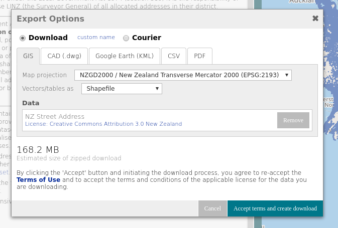
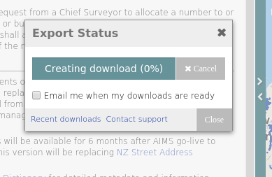
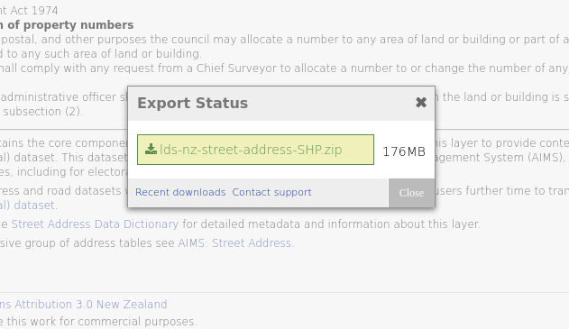

New Zealand Countrywide Data
====

Using Docker
----

`lds-nz.sh` contains a script for caching LDS data.

`Dockerfile` contains a Docker process for caching data. Docker allows for code
execution in a controlled environment. On Ubuntu, Docker can be installed with
apt-get install docker.io.

    # prepare a temporary work directory for Docker
    mkdir /tmp/work
    chgrp docker /tmp/work
    chmod ugo+rwxt /tmp/work
    cp lds-nz-street-address-electoral-SHP.zip /tmp/work/

    # build docker image
    docker build -t nz-lds .

    # run cache, leaving data in work directory
    docker run --volume /tmp/work:/work nz-lds /usr/local/bin/run-cache

    # upload contents of cache directory to S3
    aws s3 sync /tmp/work/cache s3://data.openaddresses.io/cache

Getting Data
----

