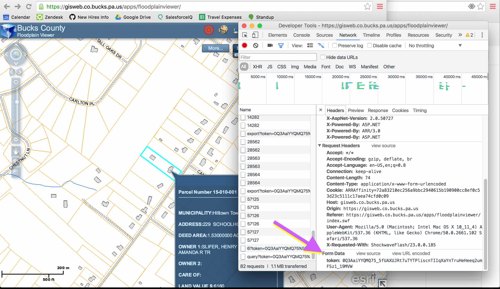

Bucks County Data
====

Bucks County, PA parcel data can be viewed using the
[Floodplain Viewer](https://gisweb.co.bucks.pa.us/apps/floodplainviewer/).

Using Docker
----

`cache.sh` contains a script for caching county data. You will need to provide
an ESRI map token, which can be found on the Floodplain viewer website. See
_Getting A Token_ below.

`Dockerfile` contains a Docker process for caching data. Docker allows for code
execution in a controlled environment. On Ubuntu, Docker can be installed with
`apt-get install docker.io`.

    # prepare a temporary work directory for Docker
    mkdir /tmp/work
    chgrp docker /tmp/work
    chmod ugo+rwxt /tmp/work

    # build the Docker image
    docker build -t us-pa-bucks .

    # run cache, leaving data in work directory
    docker run --volume /tmp/work:/work us-pa-bucks /usr/local/bin/run-cache <TOKEN>

    # upload contents of cache directory to S3
    aws s3 sync --acl public-read /tmp/work/cache s3://data.openaddresses.io/cache

Getting A Token
----

Visit Bucks County Floodplain Viewer at
https://gisweb.co.bucks.pa.us/apps/floodplainviewer/. Open your browser’s
debugging console, and look for a unique token sent as part of each request. The
value of the token, which is unique to your session and will expire, can be seen
at the bottom of this screenshot:

