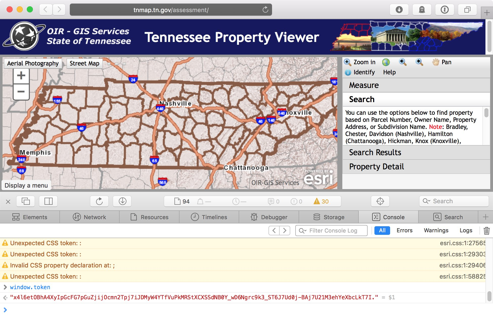

Tennessee Statewide Data
====

Tennessee statewide address data can be downloaded from OIR - GIS Services
via the [Tennessee Property Viewer](http://tnmap.tn.gov/assessment/).

More information at http://tnmap.tn.gov

Using Docker
----

`cache.sh` contains a script for caching TN data. You will need to provide an
ESRI map token, which can be found on the Tennessee Property Viewer website
website. See _Getting A Token_ below.

`Dockerfile` contains a Docker process for caching data. Docker allows for code
execution in a controlled environment. On Ubuntu, Docker can be installed with
`apt-get install docker.io`.

    # prepare a temporary work directory for Docker
    mkdir /tmp/work
    chgrp docker /tmp/work
    chmod ugo+rwxt /tmp/work

    # build docker image from cache
    curl https://data.openaddresses.io/cache/us/tn/us-tn-docker-4a3d2f591.tar.bz2 | bzcat | docker load

    # image can alternatively be built the slow way
    docker build -t us-tn .

    # run cache, leaving data in work directory
    docker run --volume /tmp/work:/work us-tn /usr/local/bin/run-cache <TOKEN>

    # upload contents of cache directory to S3
    aws s3 sync --acl public-read /tmp/work/cache s3://data.openaddresses.io/cache

Getting A Token
----

Visit Tennessee Property Viewer at http://tnmap.tn.gov/assessment/. Open your
browser’s debugging console, and type `window.token`. The value of the token,
which is unique to your session and will expire, can be seen at the bottom of
this screenshot:

